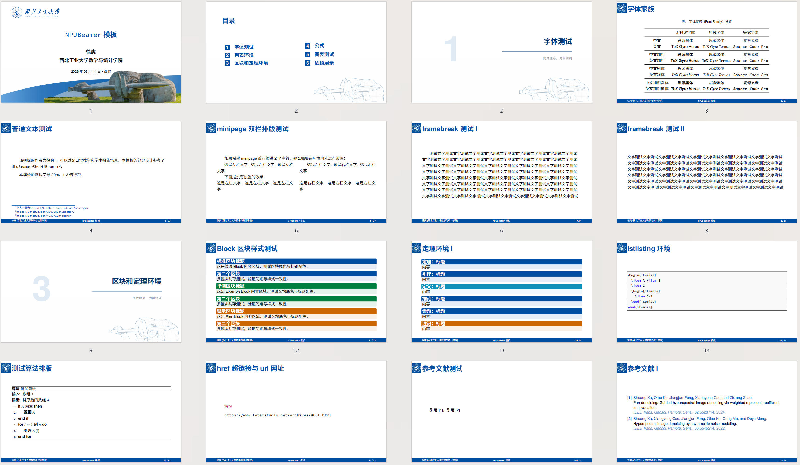

# NPUBeamer 西北工业大学 LaTeX-Beamer 模板

**简洁美观 | 西工大专属蓝调主题 | 报告/课件专用 | XeLaTeX 编译**

✨ 本模板是具有西北工业大学元素的 Beamer 模板，适配学术报告和课件制作。模板采用西工大专属蓝色主色调，排版规整、样式精致，全程使用开源字体，规避商用版权问题，支持自由开源、二次修改与个人/商用使用。

模板基于 XeLaTeX 编译，兼容中文排版，内置全套定理、定义、算法、代码、图表等环境，注释详尽、开箱即用，无需复杂配置。

## 📌 项目简介

**核心特性**

* **专属校园主题**：定制 NPU 蓝、深蓝专属配色，风格庄重学术，贴合报告/课件视觉规范
* **完整学术环境**：内置定理、引理、推论、定义、例题、习题、注记、算法、代码高亮模块
* **专业排版布局**：自定义答辩宽屏尺寸、自适应边距、双栏目录、自动章节过渡页、标准化页脚页码
* **全场景兼容**：支持公式、表格、图文混排、逐帧动画、分页展示、脚注引用、文末参考文献
* **零基础易用**：项目结构清晰、代码注释详细，一键替换个人信息即可使用

## 🖼️ 模板预览

涵盖封面页、双栏目录页、章节过渡页、字体展示页、文本排版、列表环境、定理区块、公式环境、图表表格、代码算法、参考文献等常用页面。



## 🔧 编译环境要求

**本模板仅支持 XeLaTeX 编译**，pdfLaTeX 无法适配自定义开源字体配置。

**推荐编译工具**

* 在Windows系统使用TeX Live 2018测试可以编译成功。


## 📁 项目文件结构

```plain
NPUBeamer/
├── font/                # 开源字体存放文件夹（需自行下载放入）
├── preview/                 
│   └── preview.jpg     # 没啥用，可以删了
├── src/                 
│   ├── figure/         # 封面、页头、目录背景素材图
│   └── NPUBeamer.tex   # 模板核心样式配置文件
├── ref.bib             # 参考文献库文件
├── main.tex            # 主编译文件（功能演示+答辩模板主体）
└── README.md           # 项目说明文档

```

## 💻 开源字体下载与配置（必需）

本模板所有字体均采用开源字体，请遵循官方下载方式，安装后才可正常编译显示字体样式。所有字体文件统一放入项目根目录 `font/` 文件夹。

**1. 思源黑体 / 思源宋体**

下载地址：[https://github.com/adobe-fonts/source-han-sans/tree/release#region-specific-subset-otfs](https://github.com/adobe-fonts/source-han-sans/tree/release#region-specific-subset-otfs)

下载地址：[https://github.com/adobe-fonts/source-han-serif/tree/release#region-specific-subset-otfs](https://github.com/adobe-fonts/source-han-serif/tree/release#region-specific-subset-otfs)

操作方式：打开页面后点击 `China (中国)` 对应资源下载，解压后将所有 `.otf` 格式字体文件放入 `font` 文件夹。

**2. 霞鹜文楷等宽字体**

下载地址：[https://github.com/lxgw/LxgwWenKai/releases](https://github.com/lxgw/LxgwWenKai/releases)

操作方式：下载页面中 `Source code (zip)` 压缩包，解压后提取所有 `.ttf` 等宽字体文件，放入 `font` 文件夹。

**3. Source Code Pro 英文等宽字体**

下载地址：[https://github.com/adobe-fonts/source-code-pro/releases/latest](https://github.com/adobe-fonts/source-code-pro/releases/latest)

操作方式：下载页面中 `otf`后缀对应的压缩包，解压后将所有 `.otf`字体文件放入 `font` 文件夹。

## 📝 快速使用教程

### 1\. 基础信息一键替换

直接修改 `main.tex` 顶部全局变量，快速替换个人汇报信息：

```latex
\newcommand{\ReportTitle}{你的论文/汇报标题}
\newcommand{\ReportAuthor}{你的姓名}
\newcommand{\ReportInstitute}{你的学院/单位}
\newcommand{\ReportTime}{汇报时间·地点}
```

### 2\. 内容撰写规范

* 新增章节：使用 `\section{章节名称}`，自动生成目录、章节过渡页
* 新增内容页面：使用 `\begin{frame}{页面标题} \end{frame}` 包裹页面内容
* 可直接复用模板内置的列表、公式、定理、代码、图表、算法环境，无需重复配置

### 3\. 编译运行

将编辑器编译模式设置为 **XeLaTeX**，直接编译 `main.tex`，即可生成完整 PDF。

### 4\. 报告 or 课件

`src/NPUBeamer.tex`6到8行的配置适合制作课件，页面较小，教西的大教室最后一排也可以看清楚。
```latex
\documentclass[17pt]{beamer}
\setlength{\PageHeight}{13.5cm}
\setlength{\PageWidth}{24cm} 
```

`src/NPUBeamer.tex`10到12行的配置适合制作报告/答辩，页面较大，可以放进去更多内容，提供的信息量大。
```latex
\documentclass[20pt]{beamer}
\setlength{\PageHeight}{19.05cm}
\setlength{\PageWidth}{33.866cm}  
```

## 🎨 模板特色功能

* **自动章节过渡页**：每一章自动生成带章节序号、专属标语的过渡封面，无需手动编写
* **双栏自适应目录**：内容较多时目录自动双栏排版，整洁紧凑、美观大方
* **分色学术区块**：定义、定理、引理、例题、警示内容区分配色，层次清晰
* **专业代码与算法样式**：内置代码高亮、伪代码算法模板，适配数学、计算机、工科汇报
* **标准化参考文献**：自定义文献配色与样式，支持脚注引用、文末集中展示
* **专用宽屏页面**：适配`16:9`大屏投影的宽屏尺寸，自适应会场显示设备

## ✅ 版权与开源声明

* **模板开源协议**：本项目基于 **MIT License** 开源，支持免费个人使用、商业使用、二次修改与分发
* **素材说明**：模板内置的校徽、背景图等素材仅用于学术汇报交流，禁止用于商业宣传与营销用途
* **项目致谢**：模板部分设计思路参考 dhuBeamer、HiBeamer 开源项目，特此致谢

## 📮 反馈与共建

欢迎 Star、Fork、提交 Issue，欢迎全网开发者、西工大师生共建优化模板，适配更多专业场景、修复问题、新增功能均可提交 PR。

## ⭐ Star 支持

如果本模板对你的学术汇报、课程答辩有帮助，欢迎点亮 Star，你的支持是项目持续更新的动力！


